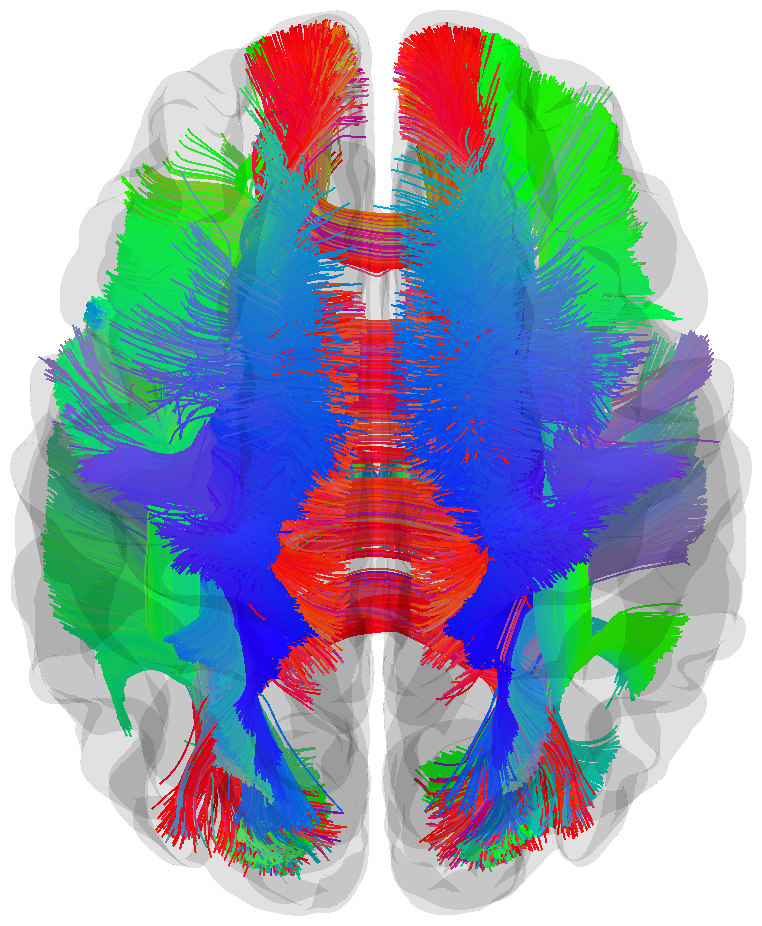

## About Me

I'm a <a href="https://ngp.usc.edu/">Neuroscience</a> PhD candidate advised by <a href="https://keck.usc.edu/faculty-search/paul-m-thompson/">Dr. Paul Thompson</a> at the Imaging Genetics Center at the University of Southern California. My research involves diffusion MRI analysis for mapping micro- and macro-structural changes of white matter tracts in neurodegenerative diseases. I'm also interested in developing and applying machine learning and AI methods for large-scale multi-site neuroimaging data to promote reproducibility and reliability of results.
 
For all inquiries, please email me at <b>&lt;yixuefen at usc.edu&gt;</b>.

<!-- ---

## Research Interests

:star2: Diffusion MRI & Tractometry  
:star2: Neurodegenerative Disease  
:star2: Normative Modeling  
:star2: Deep Generative Models -->

---

## Academic Background

- **2021 - Present：**University of Southern California (PhD, Neuroscience)
- **2019 - 2021:** University of Pennsylvania (MS, Computer and Information Science)
- **2015 - 2019:** University of Virginia (BA Computer Science and BA Cognitive Science)

---

## News and Updates

- **08/2024:** Our paper [*Microstructural Mapping of Neural Pathways in Alzheimer’s Disease using Macrostructure-Informed Normative Tractometry*](https://doi.org/10.1101/2024.04.25.591183) has been accepted to [Alzheimer's & Dementia: The Journal of the Alzheimer's Association](https://alz-journals.onlinelibrary.wiley.com/journal/15525279).
- **08/2024:** **New preprint!** *BundleAGE: Predicting White Matter Age using Along-Tract Microstructural Profiles from Diffusion MRI* is now out on [biorxiv](https://www.biorxiv.org/content/10.1101/2024.08.16.608347v1).
- **08/2024:** I passed my qualifying exam and am now a PhD candidate!
- **07/2024:** Code for our new method *Macrostructure-Informed Normative Tractometry (MINT)* is now available on [Github](https://github.com/wendyfyx/MINT).
- **05/2024:** Our work on generative AI-Based tractometry has been awarded a [seed grant from USC GenAI Research Program](https://research.usc.edu/news/2024/05/usc-oori-awards-four-faculty-led-projects-under-genai-program/) ($50K)!

<blockquote class="twitter-tweet">
Code for MINT with pretrained model and example scripts are now available at <a href="https://t.co/JEurFNf1Ws">https://t.co/JEurFNf1Ws</a>! <a href="https://t.co/5In4jSaui8">https://t.co/5In4jSaui8</a>
&mdash; Wendy Feng (@wendyfyx) <a href="https://twitter.com/wendyfyx/status/1823465191755145669?ref_src=twsrc%5Etfw">August 13, 2024</a></blockquote> 